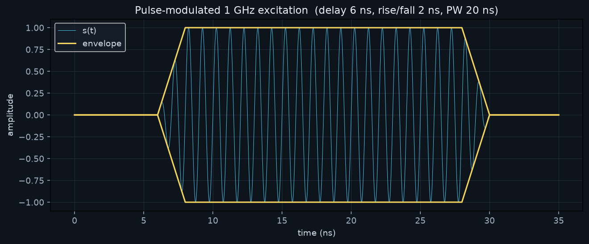
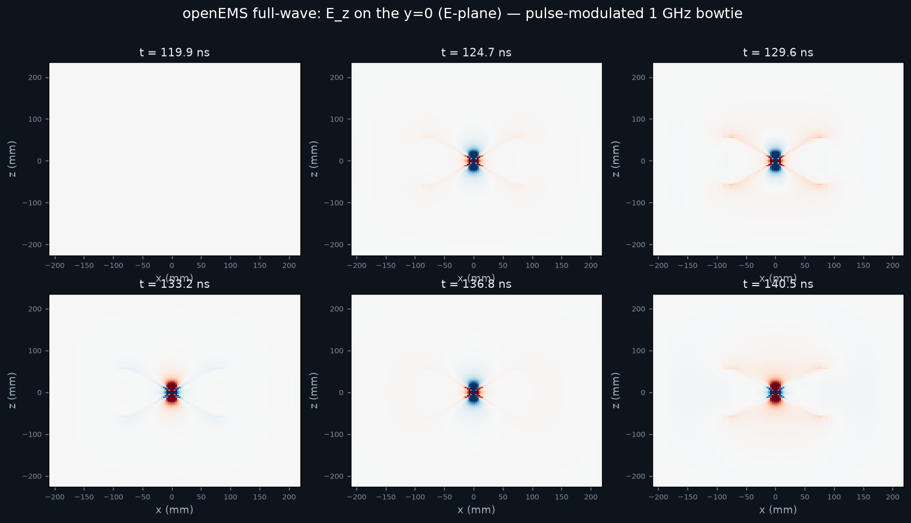

# SpecDAR 3D Waveforms — Full-Wave Pulse-Modulated 1 GHz Solver

Full-physics 3-D FDTD electromagnetic solve (**openEMS**) of a **pulse-modulated
1 GHz carrier** radiating from a bowtie dipole into free space, with time-domain
field dumps for **ParaView**. Will be used for model-based verification of reflection bevaior,
carrier wave and corresponding bow-tie size alterations, and curvurature study.

This is the full-wave companion to the original illustrative model. Where
`3D-waveform-analytical.py` *assumes* the field (direct + image dipole, an
analytical near-field sketch), `3D-waveform-openems.py` *solves* Maxwell's
equations on a Yee grid — the wavefronts, finite pulse bandwidth, and true
radiation pattern all emerge from the solve.

## Excitation waveform (to spec)

| Parameter | Value |
|-----------|-------|
| Carrier frequency | **1.0 GHz** |
| Pulse width (flat top) | **20 ns** (~20 carrier cycles) |
| Rise / fall time | **2 ns** each (trapezoidal envelope) |
| Delay before leading edge | **120 ns** |

```
s(t) = env(t) · sin(2π·f0·(t − t_delay))
env(t) = trapezoid: 0 → ramp(2ns) → 1 (20ns) → ramp(2ns) → 0,  starting at t_delay
```

The envelope is fed to openEMS as a custom function-parser string
(`FDTD.SetCustomExcite`). See `excitation.png` for the rendered waveform.



`preview_fdtd.png` is a validation montage of the solved `E_z` field on the y=0 plane — the field is **zero at t = 119.9 ns** (still inside the 120 ns delay), then the dipole **sin θ** radiation lobes appear and reverse sign with the 1 GHz carrier as the 20 ns pulse passes:



## Files

| File | Purpose |
|------|---------|
| `3D-waveform-openems.py` | The FDTD solver. Builds geometry + mesh, sets the pulse-modulated excitation, runs openEMS, writes VTK field dumps + `excitation.png`. |
| `paraview_view.py` | ParaView/pvpython script that loads the field time-series and sets up the animated 3-D view (and can batch-render a movie). |
| `3D-waveform-analytical.py` | Original analytical image-dipole near-field model (matplotlib still image). Kept for reference. |

## Verification

- The full 120 ns solve completed: 225,750 cells, dt 5.77 ps, 25,053 timesteps in ~3.4 min, stopped cleanly at −58 dB after the pulse.
- Physics confirmed: field is exactly zero through the 120 ns delay, the pulse launches at t ≈ 121 ns, shows the dipole sin θ lobes reversing sign with the 1 GHz carrier, then decays — all radiating into the PML. 1,194 frames per cut-plane in C:\Users\(your_username)\openems_runs\bowtie_pulse\.

## The model

- **Antenna:** z-oriented planar bowtie (two PEC triangles in the y=0 plane,
  narrow at a central feed gap, flaring out — `flare = 60 mm`, `arm = 75 mm`,
  `gap = 2 mm`), fed by a **50 Ω lumped port** across the gap.
- **Domain:** free space with **PML (8 cells)** on all six faces — open-region
  radiation, no reflections off the box.
- **Mesh:** graded — ~3 mm cells on the antenna (thirds-rule edge refinement),
  grading out to ≈ λ/20 (~9 mm) in the air. Full run ≈ 75×35×86 ≈ 226 k cells.
- **Dumps:** E-field time-domain on two cut planes —
  `Ez_xz` (y=0, the E-plane) and `Ez_xy` (z=0, the H-plane) — written as a
  numbered `.vtr` series (openEMS auto-decimates to ~Nyquist of `fmax`, so you
  get a few hundred animation frames, not one per timestep). Set
  `OPENEMS_DUMP3D=1` to also dump the full 3-D volume.

## Environment (local set-up)

openEMS ships native (C++) DLLs plus matching Python wheels. Python **3.13** was
used because the openEMS **v0.37.0-rc1** Windows bundle ships `cp313` wheels
(the system default 3.14 is too new for the scientific stack; there is no 3.12
wheel). What was installed:

```
openEMS bundle (DLLs + wheels)  ->  C:\Users\(your_username)\openEMS
Python 3.13 venv                ->  C:\Users\(your_username)\openems-venv
  numpy, matplotlib, h5py
  csxcad-0.7.0rc1-cp313, openems-0.37.0rc1-cp313   (from the bundle)
CSXCAD_INSTALL_PATH = C:\Users\(your_username)\openEMS       (persisted; lets Python find the DLLs)
```

### Reproducing the install from scratch

1. Download `openEMS_x64_v0.37.0-rc1_msvc.zip` from
   <https://github.com/thliebig/openEMS-Project/releases> and extract to
   `C:\Users\(your_username)\openEMS`.
2. ```powershell
   py -3.13 -m venv C:\Users\(your_username)\openems-venv
   C:\Users\(your_username)\openems-venv\Scripts\python.exe -m pip install numpy matplotlib h5py
   C:\Users\(your_username)\openems-venv\Scripts\python.exe -m pip install C:\Users\(your_username)\openEMS\python\csxcad-*-cp313-*.whl
   C:\Users\(your_username)\openems-venv\Scripts\python.exe -m pip install C:\Users\(your_username)\openEMS\python\openems-*-cp313-*.whl
   setx CSXCAD_INSTALL_PATH "C:\Users\(your_username)\openEMS"
   ```
3. **ParaView** (for visualization): install from <https://www.paraview.org/download/>
   (5.11+). Not required to run the solve — only to view the results.

> The solver script also calls `os.add_dll_directory(CSXCAD_INSTALL_PATH)` itself,
> so it works even in a shell where the env var wasn't picked up yet.

## Running the solver

```powershell
# full-fidelity run (120 ns delay, lambda/20 mesh) -> a few minutes
C:\Users\(your_username)\openems-venv\Scripts\python.exe "3D-waveform-openems.py"

# fast smoke test (6 ns delay, coarse mesh, small box) -> ~10 seconds
$env:OPENEMS_QUICK=1; C:\Users\(your_username)\openems-venv\Scripts\python.exe "3D-waveform-openems.py"
```

| Env flag | Effect |
|----------|--------|
| `OPENEMS_QUICK=1` | small/fast run for sanity checks |
| `OPENEMS_DUMP3D=1` | also dump the full 3-D E-field volume (large) |
| `OPENEMS_OUT=<dir>` | override output directory |
| `CSXCAD_INSTALL_PATH=<dir>` | location of the openEMS DLLs |

**Output goes to `C:\Users\(your_username)\openems_runs\bowtie_pulse\`** (a local, *non-OneDrive*
folder by default — a transient solve writes hundreds of small `.vtr` files and you
do not want OneDrive syncing each one). Override with `OPENEMS_OUT`.

Produced files: `Ez_xz_*.vtr`, `Ez_xy_*.vtr` (field time-series),
`port_ut_1` / `port_it_1` (feed voltage/current), `geometry.xml` (CSX geometry,
viewable in `AppCSXCAD.exe`).

## Visualizing in ParaView

**GUI:**
1. `File ▸ Open`, navigate to the output dir, pick the **`Ez_xz_..vtr`** group
   (ParaView collapses the numbered series into one entry), click **Apply**.
2. Color by **`E-Field`**. For propagating wavefronts choose a single signed
   component (e.g. **Z**) with a diverging colormap; for the pulse envelope/
   intensity choose **Magnitude**.
3. Press **Play** (▶). Scrub the time slider to the active window (see note below).

**Scripted (no manual setup, optional movie export):**
```powershell
& "C:\Program Files\ParaView 5.13.0\bin\pvpython.exe" "paraview_view.py"
# or point it at a specific run:
& "...\pvpython.exe" "paraview_view.py" "C:\Users\(your_username)\openems_runs\bowtie_pulse"
```
You can also paste it into ParaView's **Tools ▸ Python Shell**:
`exec(open(r"...\paraview_view.py").read())`.

## Note on the 120 ns delay

The 120 ns delay is honored exactly in the excitation. For a single isolated
transient pulse the absolute delay is a pure time-shift — the radiated-field
*physics* is identical to a zero-delay launch, just offset in time. Consequently
the full run spends its first 120 ns (~430 frames) with essentially zero field
before the pulse launches; **the interesting action is the ~25 ns window starting
near t ≈ 120 ns** (scrub there in ParaView). The `OPENEMS_QUICK` mode uses a short
6 ns delay to produce a tighter animation of the same propagation physics.

## Performance notes

- Full run: ≈ 226 k cells, dt ≈ 5.8 ps, ~35 k timesteps for the full 200 ns
  window; a few minutes on a desktop CPU (multi-threaded).
- The mesh is **graded** (fine on the antenna, coarse in air). An earlier
  version accidentally meshed the whole domain at the fine cell size (→ 7 M
  cells); the two-stage `SmoothMeshLines` in `build()` is the fix — refine the
  structure region first, *then* add the air-box extent and grade outward.
